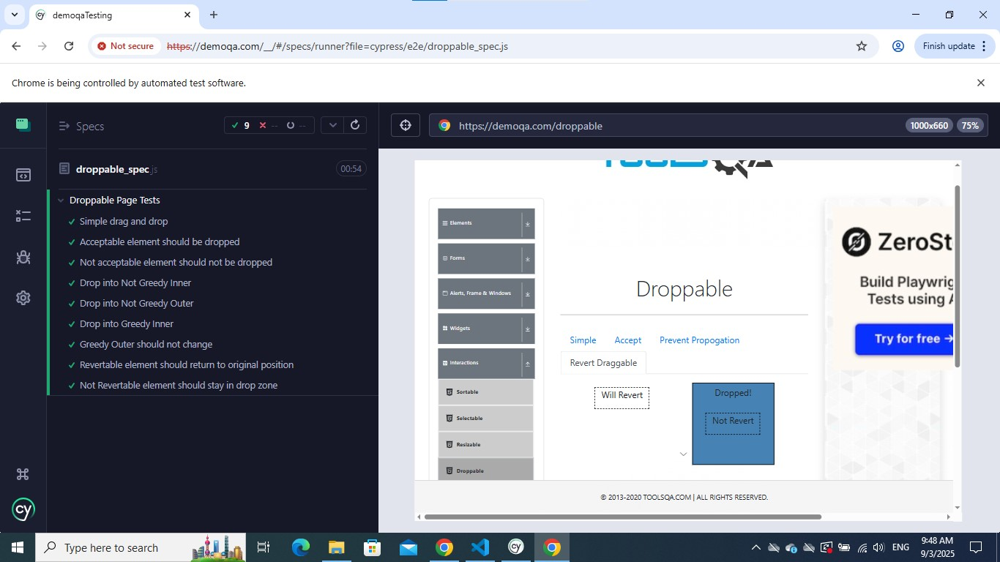
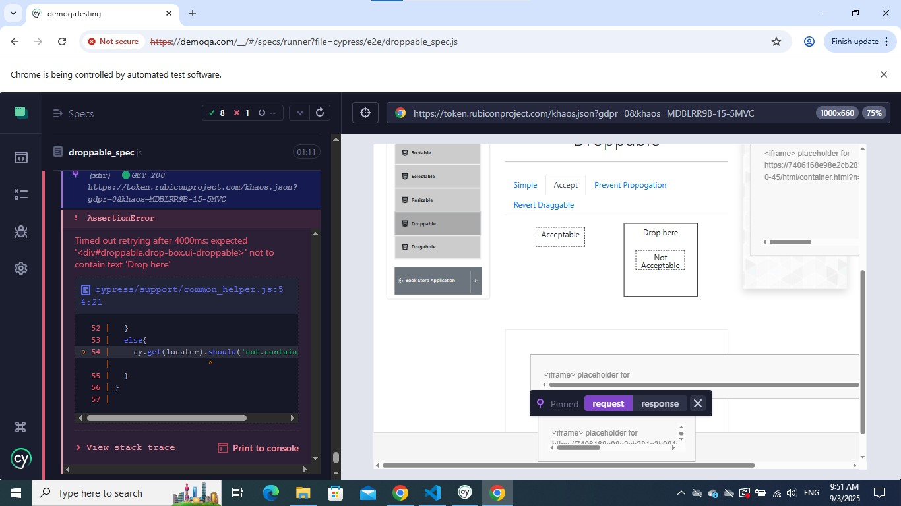
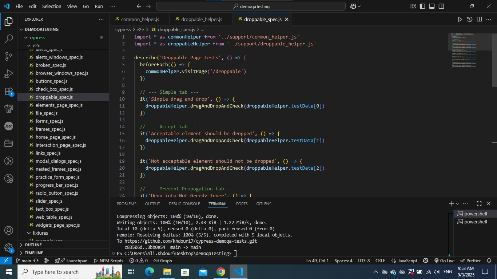
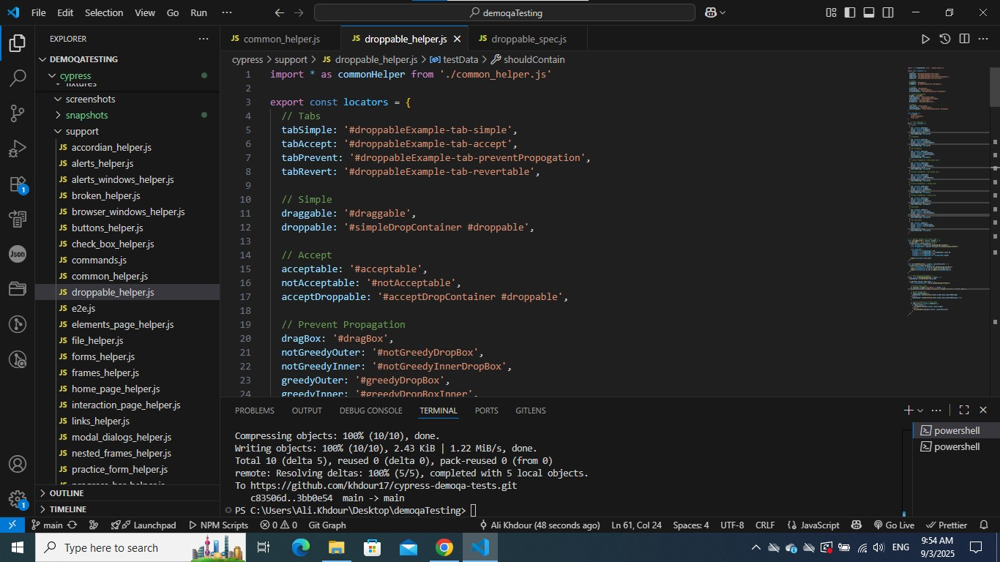

# Cypress DemoQA Tests

This repository contains end-to-end test automation for the [DemoQA](https://demoqa.com/) website using Cypress.  
It demonstrates a robust and scalable framework for automated UI testing with reusable helpers, modular structure, and clean test design. The project is designed to be easy to extend and maintain, providing reliable automated testing for a wide range of web applications.


## 📁 Project Structure:
```
  cypress-demoqa-tests/
│
├── cypress/
│ ├── e2e/
│ │   └── spec files
│ ├── support/
│ │   └── helper files
│ └── configs/
│     └── config files for different test setups
│
├── .gitignore # Ignores node_modules and Cypress videos/screenshots
├── cypress.config.js # Cypress configuration
├── package.json # Project dependencies and scripts
└── README.md # You're here!
```
## 🚀 Installation & Setup

1. **Clone the repository**
   ```bash
   git clone https://github.com/khdour17/cypress-demoqa-tests.git
   cd cypress-demoqa-tests
   ```

2. **Install dependencies**
   ```bash
   npm install
   ```

3. **Open Cypress Test Runner**
   ```bash
   npx cypress open
   ```

4. **Run tests in headless mode**
   ```bash
   npx cypress run
   ```

5. **Run tests with a specific config file**
   ```bash
   npx cypress run --config-file cypress/configs/<config-file-name>.js
   ```
   **Example:**
   ```bash
   npx cypress run --config-file cypress/configs/buttons.config.js
   ```

---

## ✅ Features

  - **Comprehensive Test Automation**:
    Covers a variety of common web application features, including forms, tables, drag-and-drop interactions, buttons, alerts, modals, sliders, progress bars, and more.
  - **Modular and Maintainable Structure**:
    Test logic, page interactions, and reusable utilities are separated, making the code easy to maintain and extend.
  - **Reusable Helpers**:
    Centralized functions for interacting with UI elements, performing complex actions, validating results, and managing test data.
  - **Locator Abstraction**:
    All element selectors are centralized to make updates easier and improve readability of tests.
  - **Clean and Readable Test Cases**:
    Spec files contain only it() blocks; all interaction logic and assertions reside in helper files.
  - **Flexible Test Configurations**:
    Supports multiple configurations for running tests across different environments, browsers, or test scenarios.
  - **Positive and Negative Testing**:
    Handles validation for correct behavior as well as error handling, form validations, and edge cases.
  - **Dynamic and Robust Assertions**:
    Includes strategies for handling timing issues, dynamic content, and asynchronous updates in UI components.
  - **Cross-Browser Support**:
    Tests can run in Chrome, Edge, Firefox, and Electron."
  - **Scalable Design**:
    Adding new pages, components, or test scenarios is straightforward, without restructuring existing code.

## Screenshots:
1. Tests Complete: Shows the Cypress test runner after all tests have successfully passed.
      
3. Error Screen: Captures the screen when a test fails, showing the assertion or error message.
      
5. Spec File: Screenshot of the spec file structure and test cases in the code editor.
      
7. Helper File: Screenshot of the helper file showing reusable functions and locators.
      

---
